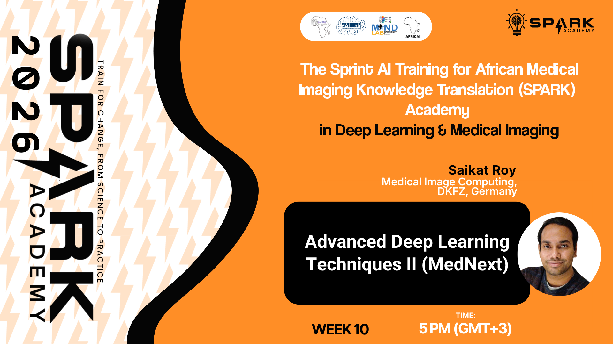
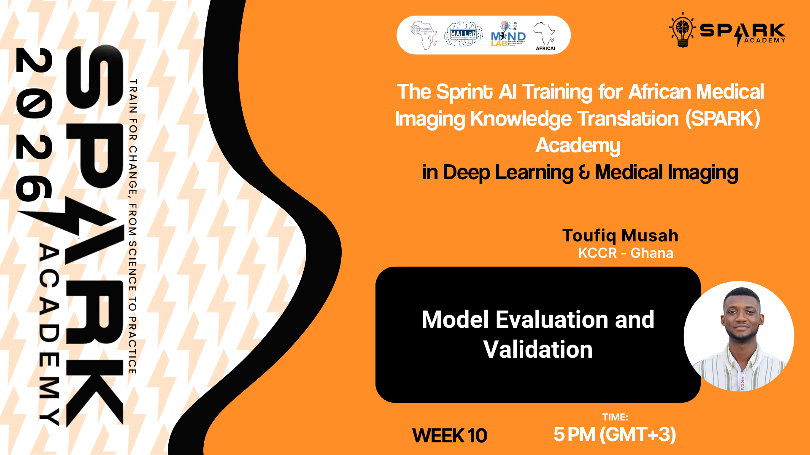
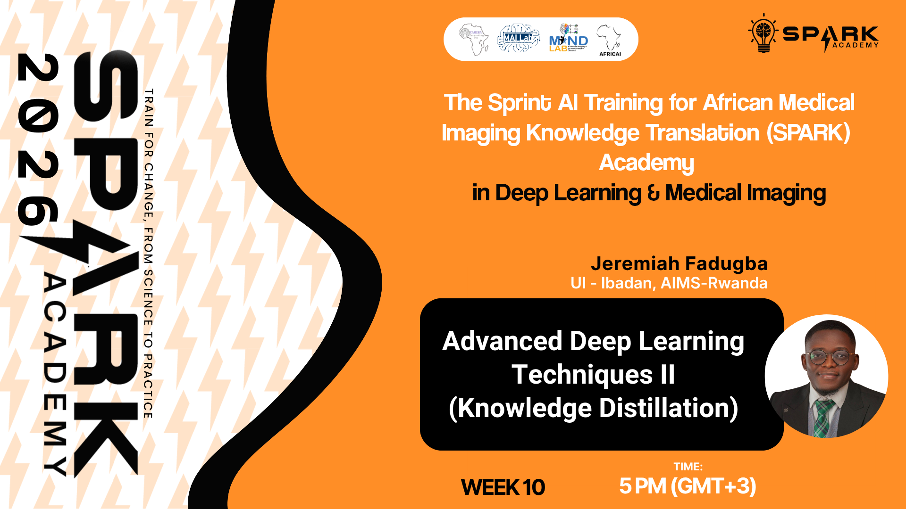
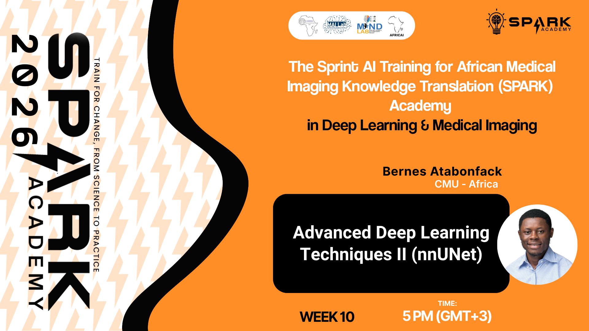
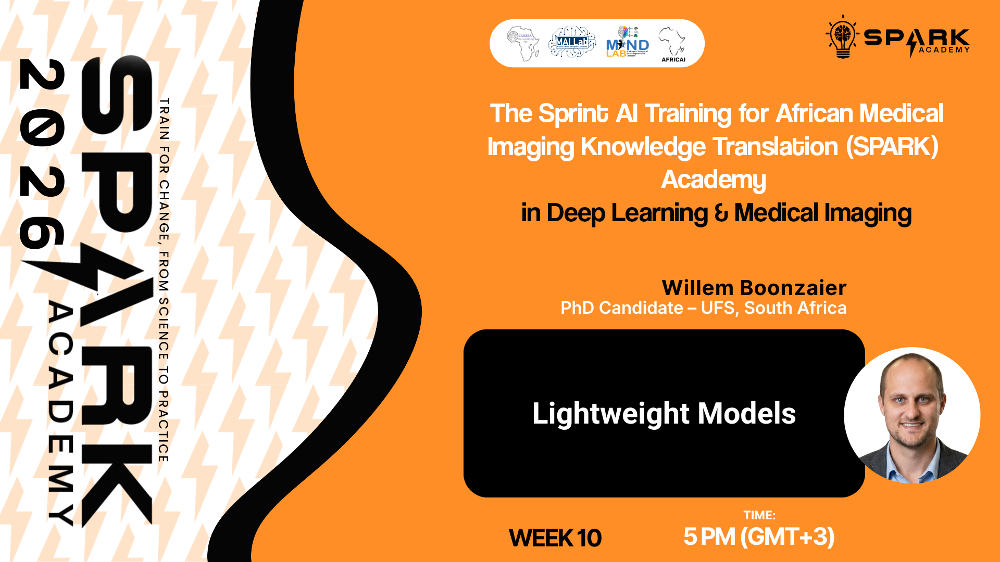

  
  
  

<h1 align="center">SPARK 2026 | Foundation Week 10</h1>
<h3 align="center">Model Evaluation, Advanced Deep Learning Techniques, and Lightweight Models</h3>

  <em>Building AI capacity for medical imaging across Africa</em>

---

## Overview

Welcome to Week 10 of SPARK Academy 2026! This week covers model evaluation and validation, a range of advanced deep learning techniques including Knowledge Distillation, MedNext, and nnUNet Models, and concludes with an introduction to lightweight models for efficient medical imaging AI.

**This week covers five sessions:**

| # | Session | Facilitator | Format |
|---|---------|-------------|--------|
| 1 | Advanced Deep Learning Techniques II (MedNext) | Saikat Roy | Live |
| 2 | Lightweight Models | Willem Boonzaier | Live |
| 3 | Model Evaluation and Validation | Toufiq Musah | Live |
| 4 | Advanced Deep Learning Techniques II (Knowledge Distillation) | 	Jeremiah Fadugba |  Pre-recorded |
| 5 | Advanced Deep Learning Techniques II (nnUNet) | Bernes Atabonfack |  Pre-recorded |

---

## Session 1: Advanced Deep Learning Techniques II (MedNext)

A live session introducing MedNext, a transformer-based architecture designed for volumetric medical image segmentation.

**Topics Covered:**
- Overview of MedNext architecture
- Transformers for medical image segmentation
- Comparison with U-Net and nnUNet
- Training and fine-tuning MedNext
- Practical applications in brain tumour segmentation

> 📂 **Slides:** [`SPARK2026_FDN_W10_MedNext.pptx`](slides/SPARK2026_FDN_W10_MedNext.pptx)

**Click the image below to watch the recorded session:**

---

## Session 2: Model Evaluation and Validation

A live session covering the essential techniques for evaluating and validating deep learning models in medical imaging, ensuring reliable and clinically meaningful performance metrics.

**Topics Covered:**
- Evaluation metrics for classification and segmentation (Accuracy, F1, Dice, IoU)
- Cross-validation strategies
- Handling class imbalance
- Statistical significance and model comparison
- Clinical validation considerations

> 📂 **Slides:** [`SPARK2026_FDN_W10_Model_Evaluation_Validation.pptx`](slides/SPARK2026_FDN_W10_Model_Evaluation_Validation.pptx)

**Click the image below to watch the recorded session:**

### Training Notebook

| Google Colab | Kaggle |
|:---:|:---:|
|  |  |

---

## Session 3: Advanced Deep Learning Techniques II (Knowledge Distillation)

A live session introducing Knowledge Distillation, a technique for training compact student models to mimic the behaviour of larger teacher models.

**Topics Covered:**
- What is Knowledge Distillation and why it matters
- Teacher-student training framework
- Soft labels and temperature scaling
- Applications in medical imaging
- Practical implementation in PyTorch

> 📂 **Slides:** [`SPARK2026_FDN_W10_Knowledge_Distillation.pptx`](slides/SPARK2026_FDN_W10_Knowledge_Distillation.pptx)

**Click the image below to watch the recorded session:**

---

## Session 4: Advanced Deep Learning Techniques II (nnUNet)

A live session covering nnUNet, the self-configuring framework for medical image segmentation that has set state-of-the-art benchmarks across numerous challenges.

**Topics Covered:**
- Overview of nnUNet and its self-configuring design
- nnUNet pipeline: preprocessing, training, and inference
- When to use nnUNet vs custom architectures
- Running nnUNet on medical datasets
- Practical tips and common pitfalls

> 📂 **Slides:** [`SPARK2026_FDN_W10_nnUNet.pptx`](https://docs.google.com/presentation/d/12tHaxs1SPhPdKtgao1NiUOU7iJQQGNEnXlC0tBD_Iug/edit?usp=sharing)

**Click the image below to watch the recorded session:**

---

## Session 5: Lightweight Models

A live session covering lightweight deep learning architectures designed for efficient inference, particularly relevant for deployment in resource-constrained clinical settings across Africa.

**Topics Covered:**
- Overview of lightweight model design principles
- MobileNet, EfficientNet, and SqueezeNet
- Model pruning and quantisation
- Edge deployment for medical imaging
- Practical trade-offs between accuracy and efficiency

> 📂 **Slides:** [`SPARK2026_FDN_W10_Lightweight_Models.pptx`](slides/SPARK2026_FDN_W10_Lightweight_Models.pptx)

**Click the image below to watch the recorded session:**

### Training Notebooks

**Notebook 1: 3D U-Net Preprocessing**

| Google Colab | Kaggle |
|:---:|:---:|
|  |  |

**Notebook 2: 3D U-Net Training**

| Google Colab | Kaggle |
|:---:|:---:|
|  |  |

---

## Assignment

### 🧠 SPARK 2026 | Week 10: Brain Tumour Segmentation

This week you will work with real 3D brain MRI data in NIfTI format and use a self-configuring medical image segmentation framework to segment brain tumours across three clinically meaningful regions: Enhancing Tumour (ET), Tumour Core (TC), and Whole Tumour (WT).

Starter notebooks are provided to guide you through the pipeline, feel free to use them or not.

> ⏰ **Deadline:** Friday 01 May 2026 · 11:59 PM (GMT+1)

📋 **[View Week 10 Assignment](https://github.com/SPARK-Academy-2025/week10_brain_tumour_segmentation)**

---

## Additional Resources

**Model Evaluation:**
- [Scikit-learn Metrics Documentation](https://scikit-learn.org/stable/modules/model_evaluation.html)
- [Metrics for Medical Image Segmentation](https://arxiv.org/abs/2206.01653)

**Knowledge Distillation:**
- [Original Knowledge Distillation Paper - Hinton et al. (2015)](https://arxiv.org/abs/1503.02531)

**MedNext:**
- [MedNext Paper](https://arxiv.org/abs/2303.09975)
- [MedNext GitHub](https://github.com/MIC-DKFZ/MedNeXt)

**nnUNet:**
- [nnUNet Paper](https://arxiv.org/abs/1809.10486)
- [nnUNet GitHub](https://github.com/MIC-DKFZ/nnUNet)

**Diffusion Models:**
- [DDPM Paper - Ho et al. (2020)](https://arxiv.org/abs/2006.11239)
- [Hugging Face Diffusers](https://huggingface.co/docs/diffusers/)

**Lightweight Models:**
- [MobileNet Paper](https://arxiv.org/abs/1704.04861)
- [EfficientNet Paper](https://arxiv.org/abs/1905.11946)

---

  <strong>SPARK Academy 2026</strong> 
  <em>Empowering the next generation of AI researchers in medical imaging across Africa</em>

  <a href="https://github.com/SPARK-Academy-2025/SPARK-2026">GitHub</a> ·
  <a href="https://www.cameramriafrica.org/contact">Contact</a> ·
  <a href="https://www.cameramriafrica.org/spark">Website</a>

