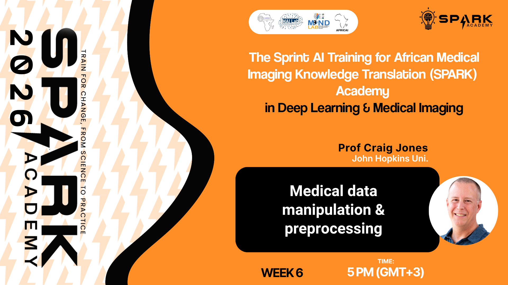
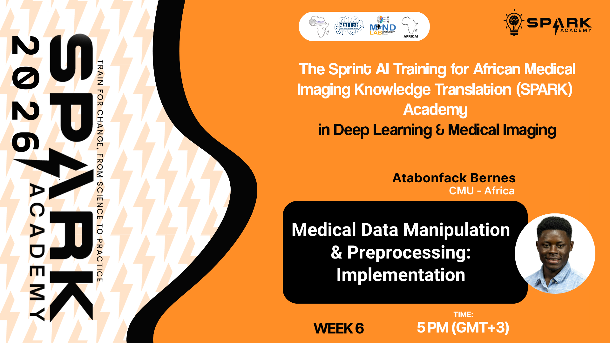

<p align="center">
  
  
  
</p>

<h1 align="center">SPARK 2026 | Foundation Week 6</h1>
<h3 align="center">Medical Data Manipulation & Preprocessing: From Theory to Implementation</h3>

<p align="center">
  <em>Building AI capacity for medical imaging across Africa</em>
</p>

---

## Overview

Welcome to Week 6 of SPARK Academy 2026! This week covers the theory and practical implementation of medical data manipulation and preprocessing — two critical steps in building reliable AI pipelines for medical imaging. Prof Craig Jones sets the conceptual foundation, followed by a hands-on implementation session with Atabonfack Bernes.

**This week covers two sessions:**

| # | Session | Facilitator | Format |
|---|---------|-------------|--------|
| 1 | Medical Data Manipulation and Preprocessing | Prof Craig Jones | Live |
| 2 | Medical Data Manipulation & Preprocessing: Implementation | Atabonfack Bernes | Pre-recorded |

---

## Session 1: Medical Data Manipulation and Preprocessing

A live session by Prof Craig Jones covering the core concepts and techniques for manipulating and preprocessing medical data in preparation for AI model development.

**Topics Covered:**
- Overview of medical data types and formats
- Data cleaning and quality control
- Preprocessing pipelines for medical imaging data
- Handling missing data and artefacts
- Normalisation and standardisation techniques

> 📂 **Slides:** [`SPARK2026_FDN_W06_Medical_Data_Preprocessing.pptx`](https://github.com/SPARK-Academy-2025/SPARK-2026/blob/main/SPARK%202026%20%7C%20Foundation%20Week%206%20-%20Medical%20data%20manipulation%20and%20preprocessing/slides/SPARK2026_FDN_W06_Medical_Data_Preprocessing.pdf)

**Click the image below to watch the recorded session:**

[](https://youtu.be/_DhKXlqTQlI)

---

## Session 2: Medical Data Manipulation & Preprocessing: Implementation

*(Pre-recorded)* A hands-on session by Atabonfack Bernes, walking through the practical implementation of medical data manipulation and preprocessing techniques using Python.

**Topics Covered:**
- Implementing preprocessing pipelines in Python
- Working with DICOM and NIfTI formats
- Image resizing, cropping, and augmentation
- Intensity normalisation and histogram equalisation
- Preparing datasets for model training

**Click the image below to watch the recorded session:**

[](https://youtu.be/uFodreduaAE)

### Training Notebooks

| Google Colab | Kaggle |
|:---:|:---:|
| [](https://colab.research.google.com/drive/1JB14ZIMQqY2YZJ-nw0ta9GSNnDPai-zW?usp=sharing) | [](https://www.kaggle.com/code/spark2025/spark-2026-week-6-medical-data-manipulation) |

---

## Assignment

### 🫀 SPARK 2026 Mini Challenge: Heart Disease Prediction

> This is a **team project**. Individual submissions will not be accepted.

Welcome to the SPARK Academy 2026 Mini Challenge! Your team's task is to build a supervised machine learning model that predicts whether a patient has heart disease (`1`) or not (`0`), using clinical measurements from the Heart Disease Dataset. Predictions will be submitted to Kaggle and evaluated using **macro-averaged F1-Score**.

This challenge is designed for you to apply the knowledge and skills built across the first six weeks of the Foundation phase.

---

#### 📊 Competition Data

The competition data files are available on the Kaggle competition page. Download `train.csv`, `test.csv`, and `sample_submission.csv` from there.

> 🔗 **Kaggle Competition:** [Heart Disease Prediction Challenge](https://www.kaggle.com/t/e49a9b57ab574a3f99b2030d571b774d)

> ⚠️ **Important:** Join and submit using your **team's verified Kaggle account**. Only verified team Kaggle accounts will have access to the competition. Individual accounts will not be accepted.

---

#### 📁 Submission Requirements

Your team must submit **two deliverables**:

**1. One-Page PDF Summary — `submission/TEAMNAME_summary.pdf`**

A single page containing:
- Team name
- Names of all participating members and their individual role in the project
- Brief description of your approach (models used, key preprocessing decisions)
- Your best leaderboard F1-Score

**2. Project Notebook**

The notebook used for your submission, clearly commented and reproducible.

---

#### 📧 Submission via Email

All submissions must be sent to the **official SPARK Academy email** using the format below:

> **To:** `info.camera.mri@gmail.com`
> **Subject:** `SPARK2026 Mini Challenge Submission`

**Email Body Format:**
```
Team Name: 

Team Members:
  - [Full Name] | [Email Address] | [Role]
  - [Full Name] | [Email Address] | [Role]
  - ...

Attachments:
  - TEAMNAME_summary.pdf
  - TEAMNAME_notebook.ipynb
```

> 📊 Once your team submits to the Kaggle competition, the **leaderboard updates automatically** — use it to monitor your team's performance and track your F1-Score against other teams in real time.

> ⚠️ Submissions that do not follow this format or are sent from an unrecognised email address may not be processed.

---

#### ⏰ Deadline

| | |
|---|---|
| **Deadline** | Friday · 11:59 PM (GMT+1) |
| **Submission** | Email + Kaggle leaderboard submission |

---

## Folder Structure

```
SPARK 2026 | Foundation Week 6 - Medical Data Manipulation & Preprocessing: From Theory to Implementation/
├── README.md
├── slides/
│   ├── SPARK2026_FDN_W06_Medical_Data_Preprocessing.pptx
├── thumbnails/
│   ├── preprocessing.png
│   └── implementation.png
├── notebooks/
│   └── SPARK2026_FDN_W06_Medical_Data_Preprocessing_Implementation.ipynb
```

---

## Additional Resources

**Medical Data Preprocessing:**
- [SimpleITK Documentation](https://simpleitk.readthedocs.io/en/master/)
- [NiBabel Documentation](https://nipy.org/nibabel/)
- [Pydicom Documentation](https://pydicom.github.io/)

**Medical Imaging Preprocessing:**
- [MONAI - Medical Open Network for AI](https://monai.io/)
- [TorchIO - Medical Image Preprocessing](https://torchio.readthedocs.io/)
- [Radiopaedia - DICOM](https://radiopaedia.org/articles/dicom)

---

<p align="center">
  <strong>SPARK Academy 2026</strong><br/>
  <em>Empowering the next generation of AI researchers in medical imaging across Africa</em>
</p>

<p align="center">
  <a href="https://github.com/SPARK-Academy-2025/SPARK-2026">GitHub</a> ·
  <a href="https://www.cameramriafrica.org/contact">Contact</a> ·
  <a href="https://www.cameramriafrica.org/spark">Website</a>
</p>