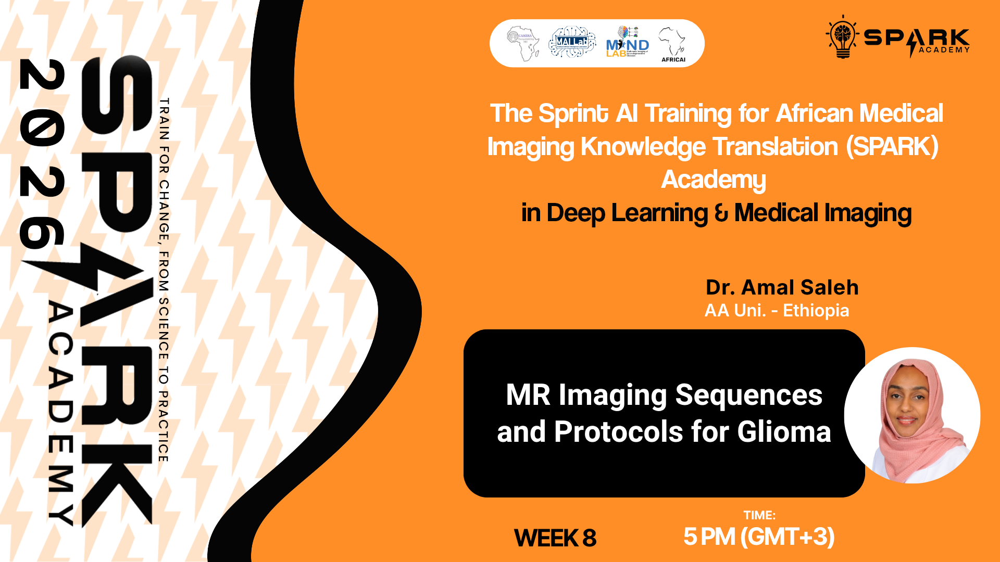
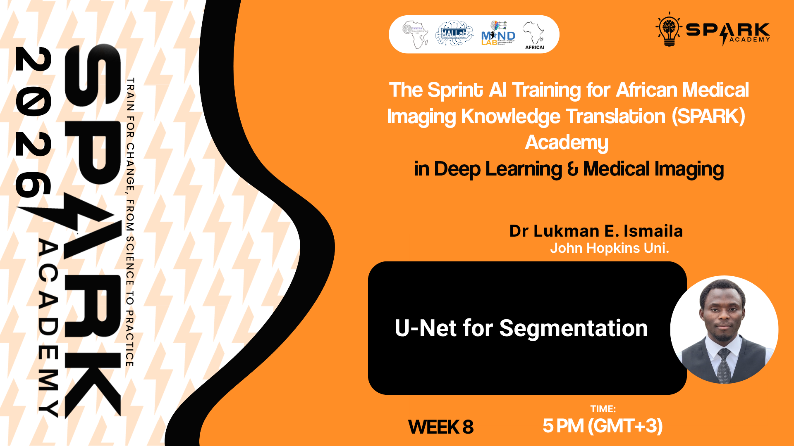

<p align="center">
  
  
  
</p>

<h1 align="center">SPARK 2026 | Foundation Week 8</h1>
<h3 align="center">MR Imaging Sequences and Protocols for Glioma and U-Net for Segmentation</h3>

<p align="center">
  <em>Building AI capacity for medical imaging across Africa</em>
</p>

---

## Overview

Welcome to Week 8 of SPARK Academy 2026! This week bridges clinical MRI knowledge and deep learning, covering the MR imaging sequences and protocols used in glioma diagnosis, and introducing the U-Net architecture, the gold standard for medical image segmentation.

**This week covers two sessions:**

| # | Session | Facilitator | Format |
|---|---------|-------------|--------|
| 1 | MR Imaging Sequences and Protocols for Glioma | Dr. Amal Saleh | Live |
| 2 | U-Net for Segmentation | Dr Lukman E. Ismaila | Live |

---

## Session 1: MR Imaging Sequences and Protocols for Glioma

A live session covering the MR imaging sequences and clinical protocols used in the diagnosis and monitoring of glioma, a primary brain tumour.

**Topics Covered:**
- Overview of glioma and its clinical significance
- MR imaging sequences used in glioma diagnosis (T1, T2, FLAIR, T1ce)
- Multi-modal MRI protocols
- Image interpretation and clinical relevance for AI models

> 📂 **Slides:** [`SPARK2026_FDN_W08_MR_Imaging_Glioma.pptx`](slides/SPARK2026_FDN_W08_MR_Imaging_Glioma.pptx)

**Click the image below to watch the recorded session:**

[](https://youtu.be/)

---

## Session 2: U-Net for Segmentation

A live session introducing the U-Net architecture, its design principles, and its application to medical image segmentation tasks including brain tumour segmentation.

**Topics Covered:**
- Introduction to image segmentation in medical imaging
- U-Net architecture: encoder, decoder, and skip connections
- Loss functions for segmentation (Dice loss, cross-entropy)
- Training and evaluating a U-Net model
- Practical segmentation examples

> 📂 **Slides:** [`SPARK2026_FDN_W08_UNet_Segmentation.pptx`](slides/SPARK2026_FDN_W08_UNet_Segmentation.pptx)

**Click the image below to watch the recorded session:**

[](https://youtu.be/)

### Training Notebook

| Google Colab | Kaggle |
|:---:|:---:|
| [](https://colab.research.google.com/) | [](https://www.kaggle.com/) |

---

# Assignment

## 🔬 SPARK 2026 Mini Challenge: Breast Lesion Segmentation

> This is a team project. Individual submissions will not be accepted.

## About This Mini Challenge

Teams will design, train, and evaluate a breast lesion segmentation model built from scratch in PyTorch. Start from U-Net, modify it, research improvements, and push your Dice score as high as you can.

## The Clinical Problem

Breast cancer is the leading cancer in women globally. In Africa, radiologists are scarce yet ultrasound machines are widely available. An AI model that segments tumours from ultrasound images gives clinicians an automated tool for localisation and measurement, directly supporting early diagnosis in resource-limited settings.

## The Data

The dataset is a curated combination of **BUSI** and **BUS-BRA** two publicly available, expert-annotated breast ultrasound datasets, deduplicated and standardised into train, val, and test splits. Each image is paired with a binary mask marking the lesion region.

🔗 **Kaggle Competition:** [SPARK 2026 | Breast Lesion Segmentation Challenge](https://www.kaggle.com/t/cf43b93116cb4834aadcc2ff21d11bf6)

> ⚠️ Join and submit using your team's verified Kaggle account only. Individual accounts will not be accepted.

📊 Once your team submits, the leaderboard updates automatically. Use it to monitor your score and track performance against other teams in real time.

---

> 🛠️ **Helper Functions:** [GitHub Repository](https://github.com/SPARK-Academy-2025/helper_functions/tree/main)

## 📁 Submission Requirements

Your team must submit two deliverables:

**1. One-Page PDF Summary** | `TEAMNAME_summary.pdf`
- Team name
- Names of all participating members and their individual role
- Brief description of your approach (architecture, modifications, key decisions)
- Your best leaderboard Dice Score

**2. Project Notebook** | `TEAMNAME_notebook.ipynb`

The notebook used for your submission, clearly commented and reproducible.

---

## 📧 Submission via Email

**To:** `info.camera.mri@gmail.com`
**Subject:** `SPARK2026 Mini Challenge Submission — TEAMNAME`

```
Team Name:

Team Members:
  - [Full Name] | [Email Address] | [Role]
  - [Full Name] | [Email Address] | [Role]
  - ...

Attachments:
  - TEAMNAME_summary.pdf
  - TEAMNAME_notebook.ipynb
```

> ⚠️ Submissions that do not follow this format or are sent from an unrecognised email address may not be processed.

---

## ⏰ Deadline

| | |
|---|---|
| **Deadline** | Friday, 17th April 2026 · 11:59 PM (GMT+1) |
| **Submission** | Email + Kaggle leaderboard submission |

---

## Folder Structure

```
SPARK 2026 | Foundation Week 8 - MR Imaging Sequences and U-Net for Segmentation/
├── README.md
├── slides/
│   ├── SPARK2026_FDN_W08_MR_Imaging_Glioma.pptx
│   └── SPARK2026_FDN_W08_UNet_Segmentation.pptx
├── thumbnails/
│   ├── mri_glioma.png
│   └── unet.png
├── notebooks/
│   └── SPARK2026_FDN_W08_UNet_Segmentation.ipynb
```

---

## Additional Resources

**MRI & Glioma:**
- [Radiopaedia - Glioma](https://radiopaedia.org/articles/glioma)
- [Radiopaedia - MRI Brain Sequences](https://radiopaedia.org/articles/mri-sequences)
- [BraTS Challenge](https://www.med.upenn.edu/cbica/brats/)

**U-Net & Segmentation:**
- [Original U-Net Paper - Ronneberger et al. (2015)](https://arxiv.org/abs/1505.04597)
- [MONAI Segmentation Documentation](https://monai.io/)
- [Segmentation Models PyTorch](https://github.com/qubvel/segmentation_models.pytorch)

---

<p align="center">
  <strong>SPARK Academy 2026</strong><br/>
  <em>Empowering the next generation of AI researchers in medical imaging across Africa</em>
</p>

<p align="center">
  <a href="https://github.com/SPARK-Academy-2025/SPARK-2026">GitHub</a> ·
  <a href="https://www.cameramriafrica.org/contact">Contact</a> ·
  <a href="https://www.cameramriafrica.org/spark">Website</a>
</p>