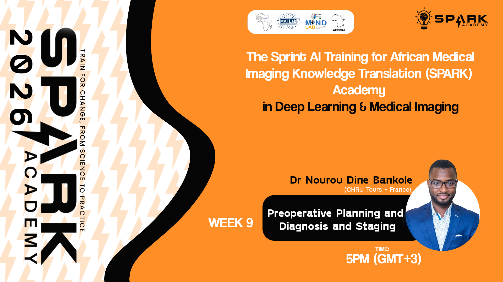
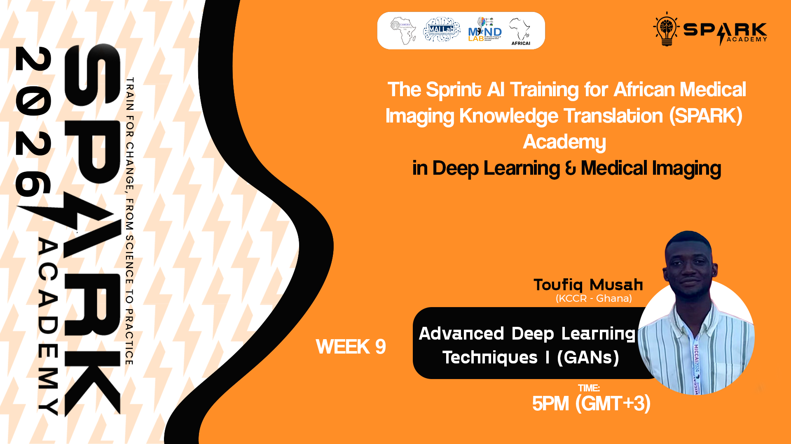
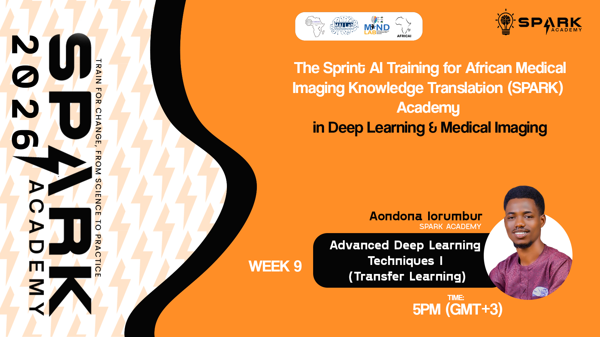

<p align="center">
  
  
  
</p>

<h1 align="center">SPARK 2026 | Foundation Week 9</h1>
<h3 align="center">Advanced Deep Learning and Clinical Applications</h3>

<p align="center">
  <em>Building AI capacity for medical imaging across Africa</em>
</p>

---

## Overview

Welcome to Week 9 of SPARK Academy 2026! This week covers the clinical application of AI in preoperative planning and diagnosis staging, and advanced deep learning techniques including GANs and Transfer Learning.

**This week covers four sessions:**

| # | Session | Facilitator | Format |
|---|---------|-------------|--------|
| 1 | Preoperative Planning and Diagnosis and Staging | Dr Nourou Dine Bankole | Live |
| 2 | Advanced Deep Learning Techniques I (GANs) |Toufiq Musah  | Live |
| 3 | Advanced Deep Learning Techniques I (Transfer Learning) | Aondona Iorumbur | Live |

---

## Session 1: Preoperative Planning and Diagnosis and Staging

A session covering the role of AI in preoperative planning and the clinical staging of diagnoses, with a focus on how medical imaging informs surgical and treatment decisions.

**Topics Covered:**
- Overview of preoperative planning workflows
- AI-assisted diagnosis and staging
- Imaging modalities used in surgical planning
- Clinical decision support systems
- Case studies in glioma and oncology

> 📂 **Slides:** [`SPARK2026_FDN_W09_Preoperative_Planning_Staging.pptx`](https://github.com/SPARK-Academy-2025/SPARK-2026/blob/main/SPARK%202026%20%7C%20Foundation%20Week%209%20-%20Advanced%20Deep%20Learning%20and%20Clinical%20Applications/slides/SPARK2026_FDN_W09_Preoperative_Planning_Staging.pdf)

**Click the image below to watch the recorded session:**

[](https://youtu.be/sKpTe6dSstU)

---

## Session 2: Advanced Deep Learning Techniques I (GANs)

A session introducing Generative Adversarial Networks and their powerful applications in medical image synthesis and data augmentation.

**Topics Covered:**
- Introduction to Generative Adversarial Networks (GANs)
- GAN architecture: generator and discriminator
- Training strategies and common challenges
- Applications of GANs in medical image synthesis
- Practical GAN examples for medical imaging

> 📂 **Slides:** [`SPARK2026_FDN_W09_Advanced_DL_GANs.pptx`](https://github.com/SPARK-Academy-2025/SPARK-2026/blob/main/SPARK%202026%20%7C%20Foundation%20Week%209%20-%20Advanced%20Deep%20Learning%20and%20Clinical%20Applications/slides/SPARK2026_FDN_W09_Advanced_DL_GANs.pptx)

**Click the image below to watch the recorded session:**

[](https://youtu.be/VojrpXYUReE)

### Training Notebook

| Google Colab | Kaggle |
|:---:|:---:|
| [](https://colab.research.google.com/drive/1qAz9_HMI2zs7tEMsOKQ2Y2YN8HynxTSa?usp=sharing) | [](https://www.kaggle.com/code/spark2025/week-9-generative-adversarial-networks-gans) |

---

## Session 3: Advanced Deep Learning Techniques II (Transfer Learning)

A session covering Transfer Learning, one of the most practical techniques in deep learning, allowing models trained on large datasets to be adapted for medical imaging tasks with limited data.

**Topics Covered:**
- Transfer Learning concepts and motivation
- Fine-tuning vs feature extraction
- Pretrained models for medical imaging (ResNet, VGG, EfficientNet)
- Domain adaptation for medical imaging
- Practical transfer learning examples


**Click the image below to watch the recorded session:**

[](https://youtu.be/PBCyxZZb3i4)

### Training Notebook

| Google Colab | Kaggle |
|:---:|:---:|
| [](https://colab.research.google.com/drive/1wC1LWnj2AicBOPyRIH_-nzwyZpkh60_I?usp=sharing) | [](https://www.kaggle.com/code/spark2025/spark2026-transfer-learning) |

---

# Assignment

## 🔬 SPARK 2026 Mini Challenge: Transfer Learning for Medical Imaging

> This is a team project. Individual submissions will not be accepted.

## About This Mini Challenge

This week you will work on **two separate challenges**, applying transfer learning techniques to the same datasets you worked on in Weeks 7 and 8. You may use your previously designed models as a starting point, integrate them with a pretrained backbone, or build a new architecture entirely, the choice is yours. The goal is to explore how transfer learning changes what you can achieve.

---

## The Two Challenges

### Challenge 1: Chest X-Ray Pneumonia Classification with Transfer Learning

🔗 **Kaggle Competition:** [SPARK 2026 | W9-CXR: Chest X-Ray Pneumonia Classification with Transfer Learning](https://www.kaggle.com/t/82696eb2b1db4bccbb96e093fd27a6b1)

### Challenge 2: Breast Lesion Segmentation with Transfer Learning

🔗 **Kaggle Competition:** [SPARK 2026 | W9-BUS: Breast Lesion Segmentation with Transfer Learning](https://www.kaggle.com/t/61a11c5ef7d8474dbf48ea8bf8ee9b61)

---

## The Clinical Problems

**Chest X-Ray:** Pneumonia is one of the leading causes of death in children under five, particularly across Sub-Saharan Africa. In Week 7, you built a CNN classifier from scratch. This week, extend or replace that model using transfer learning and see how much further you can push your Macro F1 score.

**Breast Lesion Segmentation:** Breast cancer is the leading cancer in women globally. In Africa, radiologists are scarce yet ultrasound machines are widely available. In Week 8, you built a U-Net from scratch. This week, integrate a pretrained encoder and push your Dice score higher.

---

## The Data

Both challenges use the same datasets as Weeks 7 and 8. No new data collection is needed.

**W9-CXR:** Chest X-Ray Images (Pneumonia) dataset — Kermany et al., 2018. Binary classification: Normal vs Pneumonia.

**W9-BUS:** BUSI and BUS-BRA combined — expert-annotated breast ultrasound images with binary lesion masks.

> ⚠️ Join and submit using your team's verified Kaggle account only. Individual accounts will not be accepted.

📊 Once your team submits, the leaderboard updates automatically. Use it to monitor your score and track performance against other teams in real time.

---

> 🛠️ **Helper Functions:** [GitHub Repository](https://github.com/SPARK-Academy-2025/helper_functions/tree/main)

---

## 📁 Submission Requirements

Your team must submit the following:

**1. One-Page PDF Summary** | `TEAMNAME_W9_summary.pdf`

A single page covering both challenges:
- Team name
- Pretrained model used for each challenge
- Best leaderboard score for each challenge and your Week 7 / Week 8 baseline for comparison

**2. Project Notebooks** | `TEAMNAME_W9_CXR_notebook.ipynb` and `TEAMNAME_W9_BUS_notebook.ipynb`

One notebook per challenge, clearly commented and reproducible.

---

## 📧 Submission via Email

**To:** `info.camera.mri@gmail.com`
**Subject:** `SPARK2026 Mini Challenge Submission — TEAMNAME`

```
Team Name:

Participating Members:
  - [Full Name] | [Role]
  - [Full Name] | [Role]
  - ...

Attachments:
  - TEAMNAME_W9_summary.pdf
  - TEAMNAME_W9_CXR_notebook.ipynb
  - TEAMNAME_W9_BUS_notebook.ipynb
```

> ⚠️ Submissions that do not follow this format or are sent from an unrecognised email address may not be processed.

---

## Folder Structure

```
SPARK 2026 | Foundation Week 9 - Advanced Deep Learning and Clinical Applications/
├── README.md
├── slides/
│   ├── SPARK2026_FDN_W09_Preoperative_Planning_Staging.pptx
│   ├── SPARK2026_FDN_W09_Advanced_DL_GANs.pptx
│   └── SPARK2026_FDN_W09_Advanced_DL_Transfer_Learning.pptx
├── thumbnails/
│   ├── preoperative.png
│   ├── gans.png
│   └── transfer_learning.png
├── notebooks/
│   ├── SPARK2026_FDN_W09_Advanced_DL_GANs.ipynb
│   └── SPARK2026_FDN_W09_Advanced_DL_Transfer_Learning.ipynb
```

---

## Additional Resources

**Deployment & Model Serving:**
- [FastAPI Documentation](https://fastapi.tiangolo.com/)
- [TorchScript Documentation](https://pytorch.org/docs/stable/jit.html)
- [ONNX Documentation](https://onnx.ai/)
- [Docker Getting Started](https://docs.docker.com/get-started/)

**GANs:**
- [Original GAN Paper - Goodfellow et al. (2014)](https://arxiv.org/abs/1406.2661)
- [PyTorch GAN Tutorial](https://pytorch.org/tutorials/beginner/dcgan_faces_tutorial.html)

**Transfer Learning:**
- [PyTorch Transfer Learning Tutorial](https://pytorch.org/tutorials/beginner/transfer_learning_tutorial.html)
- [Hugging Face Medical Imaging Models](https://huggingface.co/models?pipeline_tag=image-classification)

**Clinical Applications:**
- [Radiopaedia - Glioma Staging](https://radiopaedia.org/articles/glioma)
- [WHO Classification of CNS Tumours](https://www.who.int/)

---

<p align="center">
  <strong>SPARK Academy 2026</strong><br/>
  <em>Empowering the next generation of AI researchers in medical imaging across Africa</em>
</p>

<p align="center">
  <a href="https://github.com/SPARK-Academy-2025/SPARK-2026">GitHub</a> ·
  <a href="https://www.cameramriafrica.org/contact">Contact</a> ·
  <a href="https://www.cameramriafrica.org/spark">Website</a>
</p>